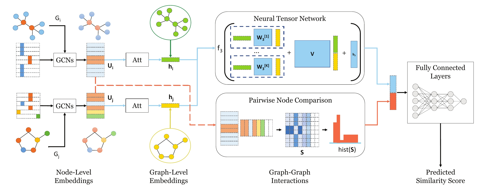
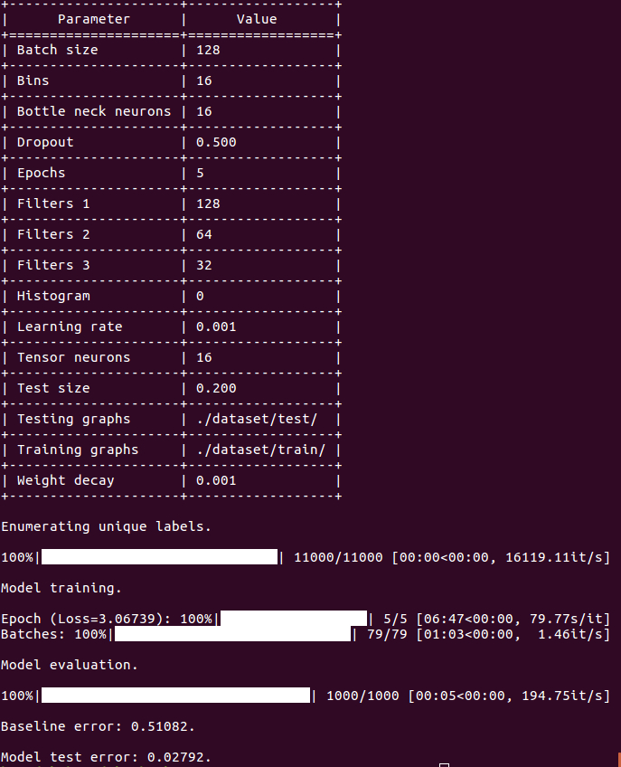

# SimGNN
=======================

[](https://paperswithcode.com/sota/graph-similarity-on-imdb?p=graph-edit-distance-computation-via-graph) [](https://codebeat.co/projects/github-com-benedekrozemberczki-simgnn-master) [](https://github.com/benedekrozemberczki/SimGNN/archive/master.zip)⠀[](https://twitter.com/intent/follow?screen_name=benrozemberczki)

**PyTorch** реализация *SimGNN: Нейронный подход к быстрому вычислению сходства графов (WSDM 2019)*.

<p align="center">
  
</p>
	
### Аннотация
<p align="justify">
Поиск сходства графов - одно из наиболее важных приложений на основе графов, например, поиск химических соединений, наиболее похожих на запрос. Вычисление сходства/расстояния между графами, такого как Редакторское Расстояние Графов (GED) и Максимальный Общий Подграф (MCS), является основной операцией поиска сходства графов и многих других приложений, но в практике очень дорого в вычислительном отношении. Вдохновленные недавним успехом нейронных подходов к нескольким приложениям на графах, таким как классификация узлов или графов, мы предлагаем новый нейронный подход к решению этой классической, но сложной задачи на графах, с целью снизить вычислительную нагрузку, сохраняя при этом хорошую производительность. Предложенный подход, названный SimGNN, объединяет две стратегии. Во-первых, мы разрабатываем обучаемую функцию вложения, которая отображает каждый граф в вектор вложения, который предоставляет глобальное описание графа. Предложен механизм внимания для выделения важных узлов с учетом конкретной метрики сходства. Во-вторых, мы разрабатываем метод парного сравнения узлов для дополнения вложений на уровне графа информацией о тонкой структуре на уровне узлов. Наша модель демонстрирует лучшую обобщаемость на невидимых графах и в худшем случае работает в квадратичном времени относительно количества узлов в двух графах. Взяв вычисление GED в качестве примера, экспериментальные результаты на трех реальных наборах данных показывают эффективность и эффективность нашего подхода. Конкретно, наша модель достигает меньшей погрешности и большого временного снижения по сравнению со многими существующими моделями на основе графических нейронных сетей. Наше исследование предполагает, что SimGNN открывает новое направление для будущих исследований по вычислению сходства графов и поиска сходства графов.</p>

В этом репозитории представлена реализация SimGNN на PyTorch, как описано в статье:

> SimGNN: Нейронный подход к быстрому вычислению сходства графов.
> Yunsheng Bai, Hao Ding, Song Bian, Ting Chen, Yizhou Sun, Wei Wang.
> WSDM, 2019.
> [[Статья]](http://web.cs.ucla.edu/~yzsun/papers/2019_WSDM_SimGNN.pdf)

Ссылка на референсную реализацию на Tensorflow доступна [[здесь]](https://github.com/yunshengb/SimGNN), и другая реализация находится [[здесь]](https://github.com/NightlyJourney/SimGNN).

### Требования
Код написан на Python 3.5.2. Используемые версии пакетов для разработки перечислены ниже.

```
networkx          2.4
tqdm              4.28.1
numpy             1.15.4
pandas            0.23.4
texttable         1.5.0
scipy             1.1.0
argparse          1.1.0
torch             1.1.0
torch-scatter     1.4.0
torch-sparse      0.4.3
torch-cluster     1.4.5
torch-geometric   1.3.2
torchvision       0.3.0
scikit-learn      0.20.0
```
### Набор данных
<p align="justify">
Код берет пары графов для обучения из входной папки, где каждая пара графов хранится в формате JSON. Пары графов, используемые для тестирования, также хранятся в файлах JSON. Каждый идентификатор узла и метка узла должны быть проиндексированы с 0. Ключи словарей хранятся как строки, чтобы обеспечить возможность сериализации в формате JSON.

Каждый файл JSON имеет следующую структуру ключ-значение:

```javascript
{"graph_1": [[0, 1], [1, 2], [2, 3], [3, 4]],
 "graph_2":  [[0, 1], [1, 2], [1, 3], [3, 4], [2, 4]],
 "labels_1": [2, 2, 2, 2, 2],
 "labels_2": [2, 3, 2, 2, 2],
 "ged": 1}
```
<p align="justify">
TКлючи graph_1 и graph_2 содержат значения списков ребер, описывающих структуру соединений. Аналогично, ключи labels_1 и labels_2 содержат метки для каждого узла, которые хранятся в виде списка - позиции в списке соответствуют идентификаторам узлов. Ключ ged имеет целочисленное значение, которое представляет собой исходное расстояние редактирования графа для пары графов.
### Опции
<p align="justify">
Обучение модели SimGNN обрабатывается сценарием `src/main.py`, который предоставляет следующие аргументы командной строки.</p>

#### Опции ввода и вывода
```
   --training-graphs   STR    Папка с обучающими графами. По умолчанию `dataset/train/`.
  --testing-graphs    STR    Папка с тестовыми графами. По умолчанию `dataset/test/`.
```
#### Опции модели
```
    --filters-1             INT         Количество фильтров в 1-м слое GCN. По умолчанию 128.
  --filters-2             INT         Количество фильтров во 2-м слое GCN. По умолчанию 64. 
  --filters-3             INT         Количество фильтров в 3-м слое GCN. По умолчанию 32.
  --tensor-neurons        INT         Нейроны в слое тензорной сети. По умолчанию 16.
  --bottle-neck-neurons   INT         Нейроны узкого места. По умолчанию 16.
  --bins                  INT         Количество бинов гистограммы. По умолчанию 16.
  --batch-size            INT         Количество пар, обрабатываемых за один проход. По умолчанию 128. 
  --epochs                INT         Количество эпох обучения SimGNN. По умолчанию 5.
  --dropout               FLOAT       Скорость отключения. По умолчанию 0.5.
  --learning-rate         FLOAT       Скорость обучения. По умолчанию 0.001.
  --weight-decay          FLOAT       Весовое уменьшение. По умолчанию 10^-5.
  --histogram             BOOL        Включить признаки гистограммы. По умолчанию False.

```
### Примеры
<p align="justify">
Следующие команды обучают нейронную сеть и считают балл на тестовом наборе. Обучение модели SimGNN на стандартном наборе данных.</p>

```
python src/main.py
```
<p align="center">

</p>

Обучение модели SimGNN на 100 эпохах с размером пакета 512.
```
python src/main.py --epochs 100 --batch-size 512
```
Обучение модели SimGNN с функциями гистограммы..
```
python src/main.py --histogram
```
Обучение модели SimGNN с функциями гистограммы и большим числом бинов
```
python src/main.py --histogram --bins 32
```
Увеличение скорости обучения и отключения.
```
python src/main.py --learning-rate 0.01 --dropout 0.9
```
Вы можете сохранить обученную модель, добавив параметр --save-path.
```
python src/main.py --save-path /path/to/model-name
```
Затем вы можете загрузить предобученную модель, используя параметр --load-path; обратите внимание, что модель будет использоваться "как есть", без проведения дальнейшего обучения.
```
python src/main.py --load-path /path/to/model-name
```
----------------------------------------------------------------------

**License**

- [GNU](https://github.com/benedekrozemberczki/SimGNN/blob/master/LICENSE)
